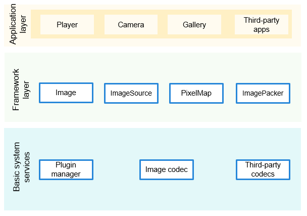

# Image<a name="EN-US_TOPIC_0000001139841951"></a>

-   [Introduction](#section11660541593)
-   [Directory Structure](#section161941989596)
-   [Repositories Involved](#section1533973044317)

## Introduction<a name="section11660541593"></a>

The  **image**  repository provides easy-to-use APIs for developing image encoding and decoding features. Currently, the following image formats are supported: JPEG, PNG, BMP.

**Figure  1**  Image architecture<a name="fig99659301300"></a>  


## Directory Structure<a name="section161941989596"></a>

The structure of the repository directory is as follows:

```
/foundation/multimedia/image   
├── frameworks                    # Framework code
│   ├── innerkitsimpl             # Native API implementation
│   └── jni                       # JNI implementation
├── ohos.build                    # Build configuration
├── interfaces                    # External APIs
│   ├── innerkits                 # APIs of other internal subsystems
│   └── kits                      # Java APIs
├── plugins                       # Image plug-in implementation
│   ├── common                    # Common image plug-ins
│   ├── manager                   # Image plug-in manager
├── test                          # Test resources
```

## Repositories Involved<a name="section1533973044317"></a>

[multimedia\_image\_framework](https://gitee.com/openharmony/multimedia_image_framework/blob/master/README_zh.md)

